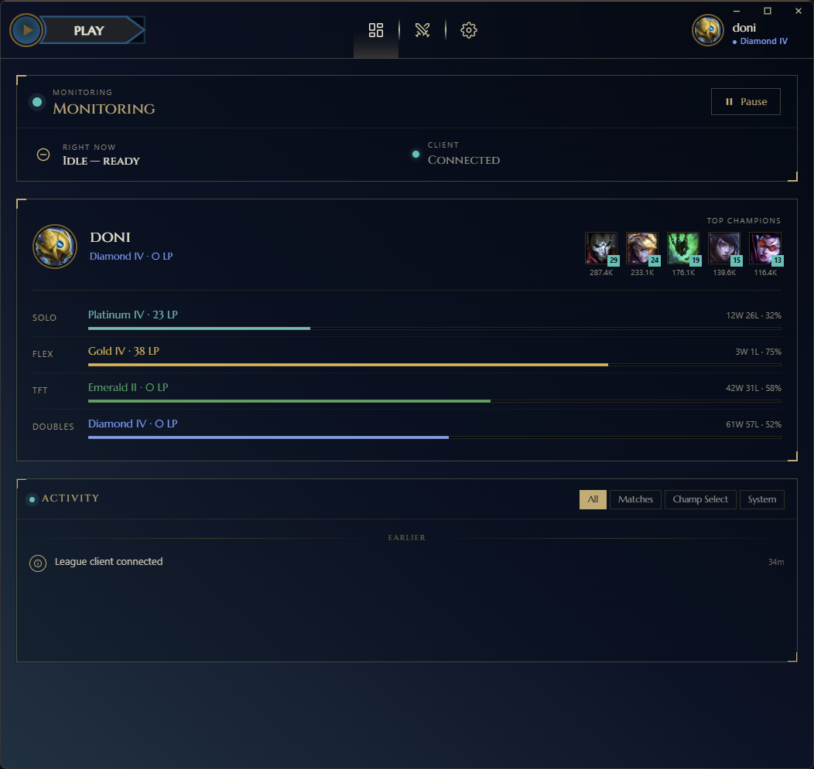
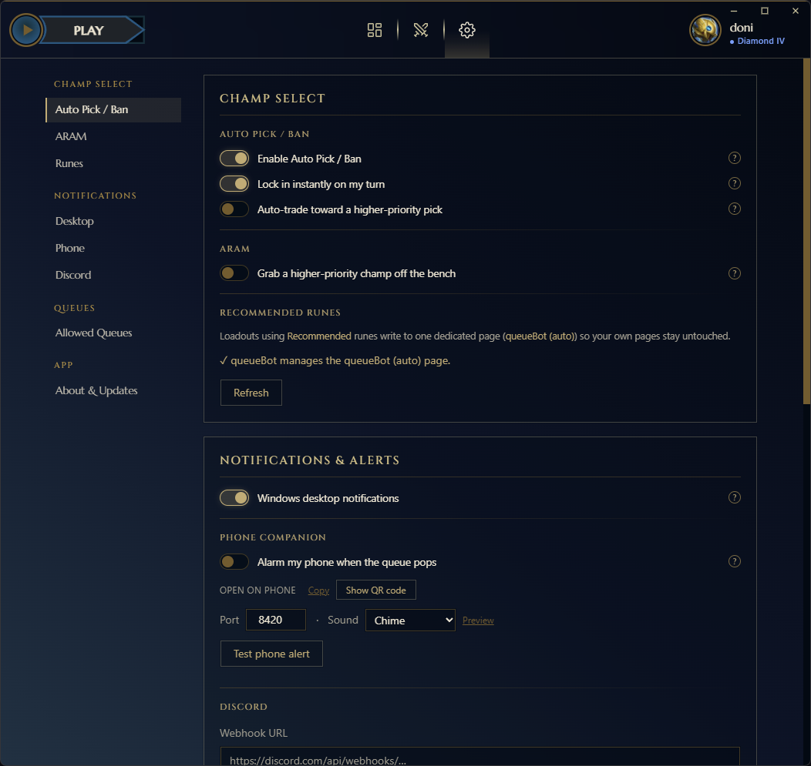
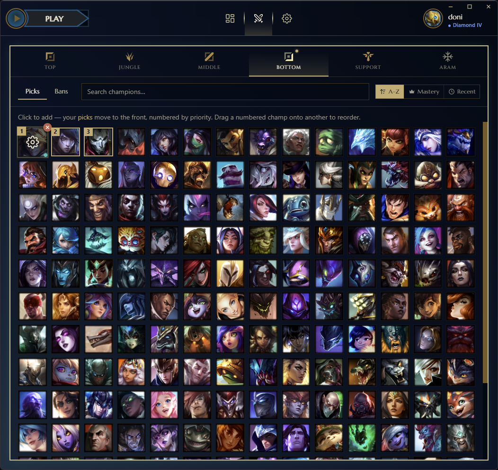
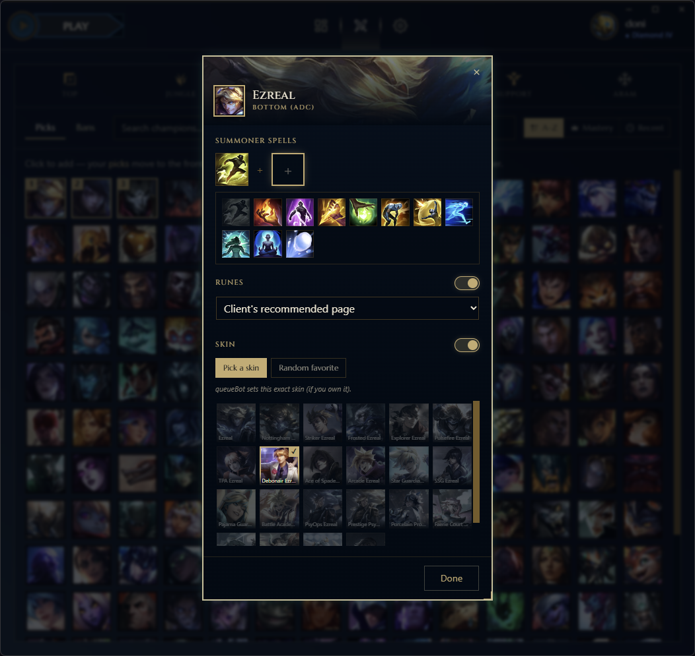
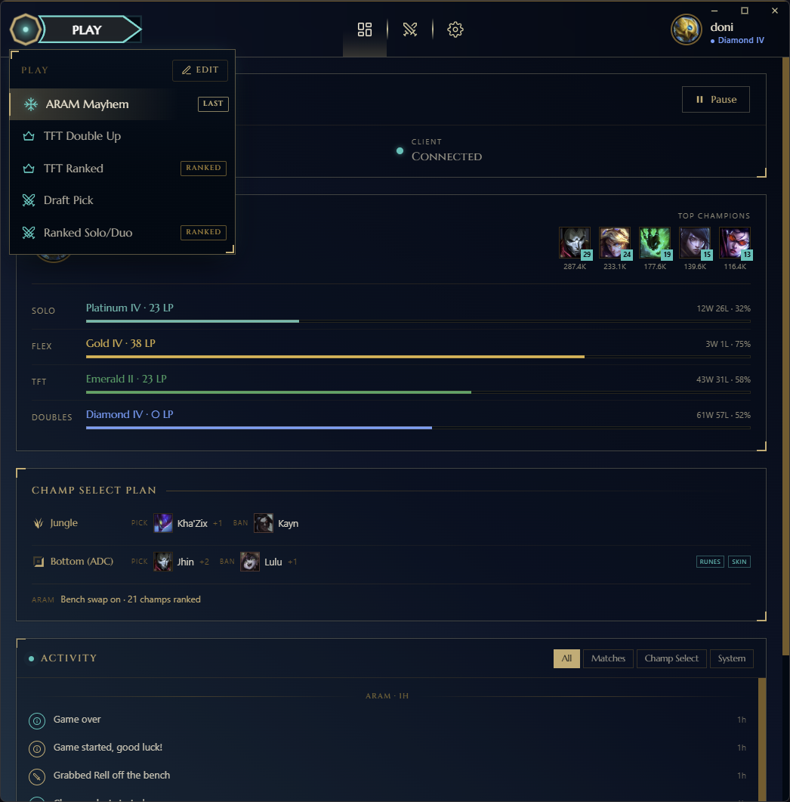
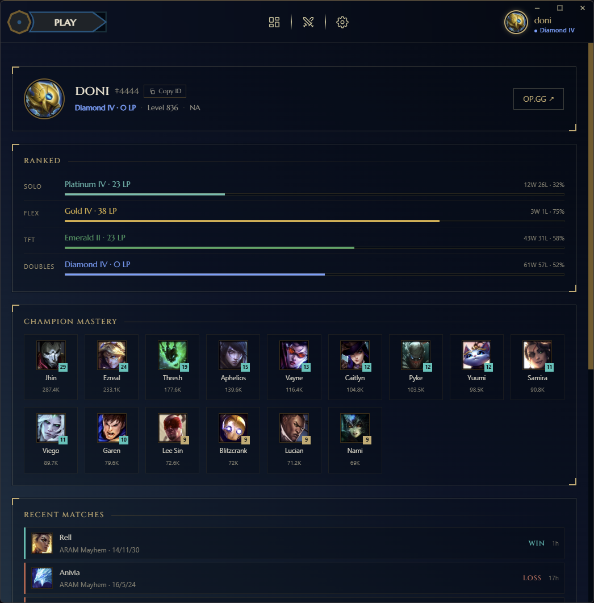
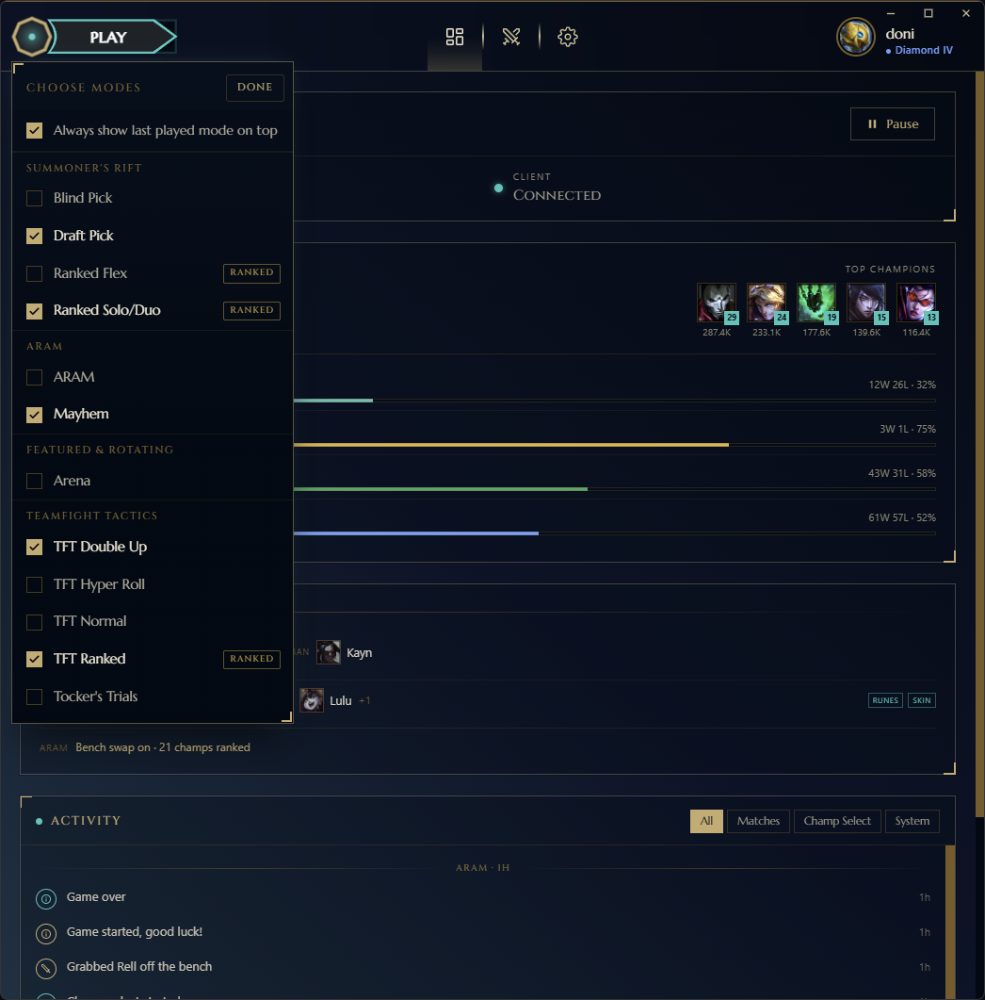

# queuePop


A lightweight, automated tool for **League of Legends** and **Teamfight Tactics** that instantly accepts queue ready checks. It runs silently in the system tray and integrates with Discord for remote notifications.

## 📸 Screenshots



| Auto pick/ban & notifications | Champion priority list |
| :---: | :---: |
|  |  |
| **Per-champion loadouts** | **One-click queue** |
|  |  |
| **Rank & mastery at a glance** | **Every queue, including TFT** |
|  |  |

## 🚀 Features

*   **Auto-Accept Queues:** Instantly accepts the "Ready Check" popup.
*   **Auto Pick & Ban:** Automatically bans and picks champions based on your assigned role, with ordered backup picks. Hovers early and locks just before the timer.
*   **Per-Champion Loadouts:** Summoner spells, runes, and skin per champion per role; applied automatically on lock-in.
*   **ARAM Bench Grab:** Watches the reroll bench and swaps to your priority champion with a fallback ranking mode.
*   **Champion Trades:** Auto-requests trades for higher-priority champions; one live request at a time, cancelled if it goes stale.
*   **Live Champ-Select View:** Real-time board of both teams: intents, locks, spells, skins, bans, and pending trades.
*   **Phone Companion:** Open on any phone; alarms when queue pops with built-in or custom alert sounds.
*   **Discord Notifications:** Webhook pings with optional @mention when your queue pops.
*   **Account Dashboard:** Riot ID, level, Solo/Flex/TFT ranks, top mastery, recent matches, and tracker links.
*   **PLAY Launcher:** One-click queue with accept delay option.
*   **Alert Event Matrix:** Fine-grained control over which events trigger which alerts.
*   **Role & Pick Priority:** Set per-role priority for champs and control which champ appears first in pick order.
*   **Auto Runes:** Loadout runes apply automatically on lock-in.
*   **Champion Data Refresh:** Auto-refresh account data (mastery, rank) on demand.
*   **Release Notes:** In-app release notes when you update.
*   **Service Record:** Review your match history with stats and win rates.
*   **Game Mode Detection:** Smartly identifies Ranked, ARAM, TFT, Blind Pick, and more.
*   **System Tray Integration:** Runs in the background; close the window to hide it to the tray.
*   **Zero-Interference:** Uses the official LCU API directly; no screen scraping or mouse hijacking.

## 🎮 Draft Simulator

The **Draft Sim** is a standalone web app and counter-pick engine that helps you plan team comps and understand matchups. Run it locally with `python scripts/draft_sim_server.py` or deploy it with Docker: `docker build -t queuepop-draft-sim . && docker run -p 5000:5000 queuepop-draft-sim`.

## 📥 Installation

### Option 1: Installer (Recommended)
1.  Go to the [Releases](../../releases) page.
2.  Download `queuePop-v<version>-setup.exe`.
3.  Run it. It installs for the current user (no admin prompt), adds a Start
    Menu entry, and can optionally create a desktop shortcut and start with
    Windows.

### Option 2: Portable
1.  Download `queuePop-v<version>-portable.zip` from [Releases](../../releases).
2.  Extract it anywhere and run `queuePop.exe`.

> **Auto-updates:** both flavours check for new releases on launch. When one is
> available you'll see an **Update** banner, one click downloads it and
> restarts into the new version (the installer build updates silently; the
> portable build swaps its own `.exe`). You can also check manually under
> **Settings → About & Updates**.

### Option 3: Run from Source
If you are a developer, you can run it directly with Python.

1.  Clone the repository.
2.  Install dependencies:
    ```bash
    pip install -r requirements.txt
    ```
3.  Run the application from the repository root:
    ```bash
    python src/main.py
    ```

## ⚙️ Configuration

On the first run, queuePop creates a default config file and opens the app window with all automation disabled. You'll configure everything in the UI as you go.

**Optional setup:**
1.  **Discord Webhook:** Paste a webhook URL in the Alerts tab to get notified when queue pops.
2.  **Discord User ID:** Enter your ID (e.g., `123456789`) for an @mention in those pings.
3.  **Allowed Queues:** Under the Dashboard, toggle which game modes to auto-accept.

### Auto Pick & Ban
Click the **Champ Select** tab in the app and configure per-role bans and picks:

1.  Tick **Enable Auto Pick / Ban**.
2.  For each role, enter comma-separated champion names for **Ban(s)** and **Pick(s)**, e.g. `Ahri, Syndra, Lux`. Picks are tried in order, so list backups in case your first choice is banned or already taken by a teammate.
3.  Set the **lock-in** timer (default `1` second). Your pick is *hovered* immediately, so you can still change it manually, and force-locked once the phase has this many seconds left.

> Role-based pick & ban applies to queues with assigned roles (Draft Pick, Ranked Solo/Duo, Ranked Flex). Blind Pick has no roles and is left alone.

### ARAM
In ARAM, queuePop watches the reroll bench and instantly grabs the best champion when one appears. Under **Champ Select → ARAM**:

*   **ARAM takeover** — toggle to enable the whole system (bench grabs, champion trades, auto-loadout).
*   **Fallback mode** — pick how queuePop ranks champions beyond your priority list:
    - **Off:** List only; queuePop never goes beyond your picks.
    - **Highest:** Falls back to your most-played champs.
    - **Lowest:** Falls back to champs you've barely touched (never-played first).
    - **Rusty:** Falls back to whichever you haven't played in the longest.
    - **Milestone:** Falls back to whichever is closest to the next mastery level.
    - **Random:** Falls back to a shuffled order per lobby.

Build a priority list in the **ARAM** tab of the **Champ Select** editor. Whatever champ you end up on gets its saved loadout (runes, spells, skin) applied automatically.

### Modifying Settings
*   Open the app window and use the **Settings** tab — every change auto-saves.
*   **Right-click** the system tray icon and select **Exit** to close the app.
*   *(To start fresh, delete the `config.json` file and restart the app.)*

## 🖥️ Usage

1.  Launch `queuePop.exe` — the window opens on the Dashboard tab.
2.  Configure your picks, bans, alerts, and queue filters in the app. All changes auto-save.
3.  **Right-click** the tray icon (Thresh sigil) to:
    *   **Open queuePop:** Show the app window.
    *   **Pause/Resume:** Temporarily disable all automation.
    *   **Show/Hide Console:** View the activity log and debug output.
    *   **Exit:** Close the application.
4.  Close the window to hide it to the tray; the app keeps running in the background.

## 🛠️ Building

To build the executable yourself using PyInstaller:

```bash
pip install pyinstaller
python -m PyInstaller scripts/queuePop.spec
```

The output will be in the `dist/` folder. For a full clean build, run:

```bash
python scripts/build_release.py
```

That fetches League assets, compiles the Tailwind CSS, runs PyInstaller, and
writes these artifacts to `releases/`:

| Artifact | What it is |
|---|---|
| `queuePop-v<version>-setup.exe` | Inno Setup installer (the installed flavour) |
| `queuePop-v<version>-portable.zip` | Zipped portable exe |
| `queuePop.exe` | Bare exe, the asset the portable auto-updater downloads |

The installer step needs [Inno Setup](https://jrsoftware.org/isdl.php) on your
PATH; if it's missing, the script warns and still produces the portable
artifacts. The installer script lives at `installer/queuePop.iss`.

## 🚢 Releasing

Releases are built and published by GitHub Actions
([`.github/workflows/release.yml`](.github/workflows/release.yml)) on
`windows-latest`:

1.  Bump `__version__` in [`src/_version.py`](src/_version.py).
2.  Commit, then tag and push:
    ```bash
    git tag v1.2.0
    git push origin main --tags
    ```
3.  The workflow verifies the tag matches `_version.py`, builds all three
    artifacts, and publishes a GitHub Release with auto-generated notes. Users
    on older versions get the in-app update prompt.

You can also trigger it manually from the **Actions** tab (it uses the version
in `_version.py` and creates the matching tag).

## 📄 License

This project is licensed under the MIT License - see the [LICENSE](LICENSE) file for details.

---
*Note: This project is not endorsed by Riot Games and doesn't reflect the views or opinions of Riot Games or anyone officially involved in producing or managing League of Legends.*
